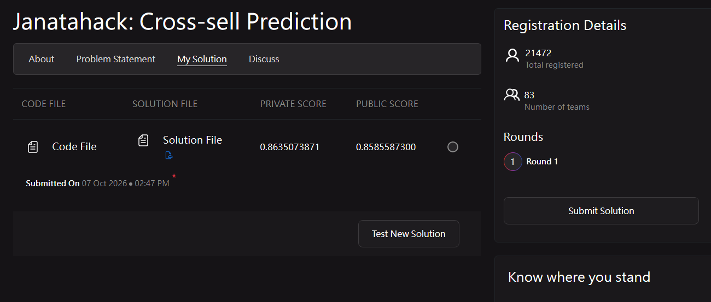
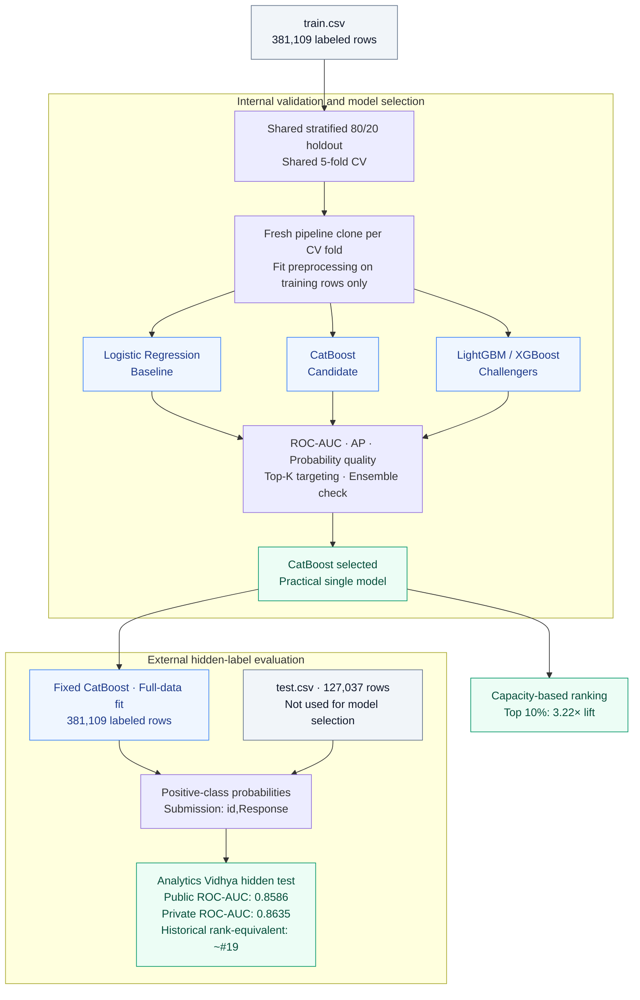

# Health Insurance Cross-Sell ML

> A weekend ML side project for customer response prediction, leakage-aware validation, and capacity-based campaign prioritization.

The goal goes beyond binary classification: rank customers by response probability so limited campaign capacity can be allocated to the most promising customers. This case study follows the path from an interpretable baseline to a validated CatBoost model and external hidden-label evaluation.

> **External benchmark:** Single-model CatBoost achieved **0.863507 private ROC-AUC** on the original Analytics Vidhya hidden test, corresponding to approximately the **historical #19 score range**.
>
> [https://www.analyticsvidhya.com/datahack/contest/janatahack-cross-sell-prediction/](https://www.analyticsvidhya.com/datahack/contest/janatahack-cross-sell-prediction/)
>
> 
>
> <sub>Late submission; historical rank-equivalent only, not an official competition placement.</sub>

`Python · scikit-learn · CatBoost · LightGBM · XGBoost`

## Key results


| Evaluation                           | ROC-AUC             |
| ------------------------------------ | -------------------: |
| CatBoost holdout                     | 0.858692            |
| 5-fold CV                            | 0.858935 ± 0.001263 |
| Analytics Vidhya public hidden test  | 0.8585587300        |
| Analytics Vidhya private hidden test | **0.8635073871**    |


**Top 10% targeting — holdout simulation**

- 7,623 customers contacted; 3,013 responders found
- 32.25% responder capture; 39.53% response rate
- 3.22× lift; overall response rate = 12.26%

> Contacting only the highest-scored 10% of customers captures about one-third of all responders.

The targeting analysis uses 76,222 held-out rows. CV reports CatBoost's mean ± fold standard deviation; hidden-test scores come from the final competition submission.

## Architecture at a glance



Two outputs serve different purposes: internal scores support capacity-based targeting, while the final full-data model produces competition probabilities. The test branch enters only after model selection, with no labels available to the training pipeline.

## Why the validation is trustworthy

- A fixed stratified holdout anchors the business analysis.
- Competing models use the same five shuffled, stratified CV folds.
- Every CV fold starts with a fresh model/pipeline clone.
- Learned preprocessing uses training-fold rows only.
- IDs are excluded from predictors; `Response` is separated from features.
- Row-index fingerprints and raw-data integrity checks support auditability.

> The experiment was designed not only to run, but to leave evidence that it ran correctly.

## Model comparison

### Logistic Regression

An interpretable baseline with a scikit-learn `Pipeline` and `ColumnTransformer` for numeric scaling and categorical encoding. It establishes a clear reference before introducing boosted trees.

### CatBoost

The best practical single model by mean CV average precision, with strong Top-K targeting. Native categorical handling reuses consistent feature formatting; the selected configuration remains fixed for final inference.

### LightGBM / XGBoost

Controlled boosted-tree challengers evaluated on identical holdout rows and folds. Fixed configurations make the comparison reproducible, without claiming each model family's best tuned performance.

### Ensemble check

Predefined probability blends produced negligible incremental gains, alongside highly correlated boosting scores. They did not clear the conservative AP-and-targeting improvement rule, so CatBoost remained the practical choice. [Saved comparison evidence](outputs/metrics/model_family_decision.json) records that decision.

## External hidden-label validation

The final submission used a single CatBoost model trained on all 381,109 labeled rows. No ensemble or leaderboard-driven tuning was used. After model selection, it predicted the untouched **127,037-row** test set from [Analytics Vidhya Janatahack: Cross-sell Prediction](https://www.analyticsvidhya.com/datahack/contest/janatahack-cross-sell-prediction/).

- Internal 5-fold CV: **0.858935 ± 0.001263**
- Public hidden test: **0.8585587300**
- Private hidden test: **0.8635073871**

The public hidden-test score closely matches internal CV, providing an external check on the selected model's discrimination.

> By historical score ordering, the private ROC-AUC of 0.8635073871 would fall approximately at rank #19, between the displayed historical scores around #18 and #19. Because this was submitted after the original competition had ended, this is a rank-equivalent score comparison rather than an official competition placement.

[Historical leaderboard](https://www.analyticsvidhya.com/datahack/leaderboard/janatahack-cross-sell-prediction/) · [Standalone submission code](outputs/submissions/catboost_submission_code.py)

## Business interpretation

The model is a ranking system: campaign capacity determines K. For a campaign covering 10% of the holdout population, the simulated targeting path is:

> Top 10% → 7,623 contacted → 3,013 responders → 39.53% segment response rate → 3.22× lift

This captures 32.25% of all holdout responders by contacting only 10% of customers. A 0.5 probability threshold is a reporting diagnostic, not the operational decision rule. The useful question is who to prioritize within a contact limit, rather than how many scores exceed an arbitrary cutoff.

## Repository map

```text
src/
├── data.py               # loading + split
├── train.py              # Logistic pipeline
├── evaluate.py           # metrics + Top-K
├── train_catboost.py     # CatBoost
├── compare_models.py     # holdout + CV audit
├── benchmark_models.py   # model-family comparison
└── submit_catboost.py    # final hidden-test inference
tests/                   # validation + submission checks
outputs/
├── metrics/
├── figures/
└── submissions/
```

Start with `data.py`, `train.py`, and `evaluate.py` for the baseline; follow the comparison modules for model selection and `submit_catboost.py` for the final full-data fit. [Holdout metrics](outputs/metrics/catboost_holdout.json) and [CV summary](outputs/metrics/cv_summary.csv) retain the numerical evidence behind the headline results.

## Limitations

- Random stratified CV is not temporal validation and does not establish customer-level separation.
- Scoring-time availability of features, especially `Previously_Insured` and `Vehicle_Damage`, must be confirmed.
- `Response` definition/window and `Vintage` semantics need business clarification.
- Campaign ROI requires real contact costs and customer-value assumptions, which are unavailable here.

## What this project demonstrates

- Clean scikit-learn `Pipeline` / `ColumnTransformer` design
- Leakage-aware validation with training-local preprocessing
- Model-family comparison on shared folds
- Top-K translation from model scores to campaign capacity
- Reproducibility through saved parameters, metrics, and integrity checks
- External hidden-label verification after model selection

> The main goal was building a compact ML workflow whose validation, business interpretation, and external behavior agree.